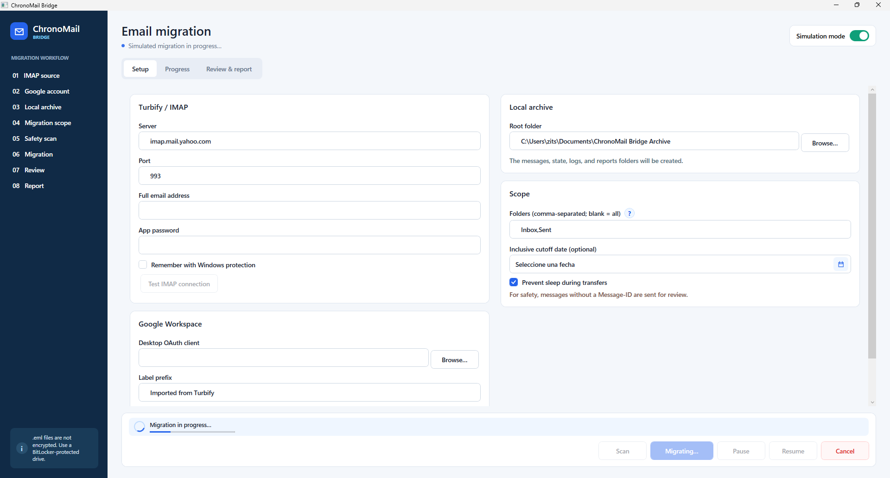

# ChronoMail Bridge

A WPF application for archiving historical email from Turbify/Yahoo Small Business as `.eml` files and importing it conservatively into Google Workspace. It is designed for long-running jobs, with SQLite persistence, resumability, deduplication, and one transfer at a time.

> `.eml` files contain business information and are not encrypted by this MVP. Choose a BitLocker-protected NTFS drive with sufficient free space.



## MVP status

Included features:

- read-only IMAP through MailKit (`FolderAccess.ReadOnly`, `BODY.PEEK`), batches of 250, and an inclusive cutoff date;
- atomic `.part` → `.eml` archival, SHA-256, confined paths, and hashed names;
- SQLite with WAL, UIDVALIDITY, occurrences, logical identities, states, and sessions;
- deduplication using confirmed imports, SHA-256, Message-ID, and `rfc822msgid:` searches;
- Gmail `users.messages.import`, the `gmail.modify` scope, additive labels, and resumable uploads for messages of 10 MiB or larger;
- DPAPI `CurrentUser` protection for tokens, the OAuth client, and session URIs;
- pause, cancellation, exponential backoff with jitter, a circuit breaker, and sleep prevention;
- a WPF interface, a simulated mode with 100 messages, and reports without sensitive content;
- fake adapters and an automated end-to-end simulation.

The application does not modify DNS, MX records, or domains; it does not use POP or Outlook; and it never deletes or changes email in Turbify.

## Requirements and commands

- Windows 10/11 x64.
- .NET SDK 8.0.423 or a compatible 8.0.x release.

```powershell
$env:DOTNET_CLI_HOME = Join-Path (Get-Location) ".dotnet-home"
dotnet restore
dotnet build -c Release
dotnet test -c Release
dotnet format --verify-no-changes
dotnet run --project src/ChronoMailBridge.App
```

Single-file portable publishing:

```powershell
dotnet publish src/ChronoMailBridge.App -c Release -r win-x64 --self-contained true -p:DebugType=None -p:DebugSymbols=false -o artifacts/publish/single-file
Copy-Item artifacts/publish/single-file/ChronoMailBridge.App.exe artifacts/ChronoMailBridge-win-x64.exe -Force
```

The resulting `.exe` contains the .NET runtime and extracts native dependencies to the current user's temporary bundle directory when needed.

## Safe first use

1. Start with **Simulation mode** enabled, then select **Scan** and **Start**.
2. Prepare a folder on a BitLocker-protected drive. Keep at least the estimated IMAP size plus the greater of 10% or 2 GiB free.
3. Create the OAuth client by following [docs/GOOGLE_OAUTH.md](docs/GOOGLE_OAUTH.md).
4. Create an app password by following [docs/TURBIFY.md](docs/TURBIFY.md).
5. Run the [docs/PILOT_TEST.md](docs/PILOT_TEST.md) with 50–100 old messages.
6. Only then expand the folder and date range.

## Storage

```text
<root>/
  messages/<folder-slug>~<hash>/<uidvalidity>/<uid>.eml
  state/chronomail.db
  state/secrets/*.bin
  logs/chronomail-YYYY-MM-DD.log
  reports/summary.csv
  reports/errors.csv
  reports/summary.txt
```

SQLite separates downloading each occurrence (folder/UID) from importing a logical message. If the same message appears in several folders, every local file is retained while all occurrences share a single import. See [docs/STORAGE_AND_RESUMPTION.md](docs/STORAGE_AND_RESUMPTION.md).

## Gmail

The implementation follows the current official documentation:

- [`users.messages.import`](https://developers.google.com/workspace/gmail/api/reference/rest/v1/users.messages/import): does not send email, supports up to 150 MB, and accepts `internalDateSource=dateHeader`;
- [OAuth for installed applications](https://developers.google.com/identity/protocols/oauth2/native-app): the system browser and a loopback redirect for desktop applications;
- [labels](https://developers.google.com/workspace/gmail/api/guides/labels): `SENT` and `DRAFT` are not applied manually;
- [resumable uploads for .NET](https://googleapis.dev/dotnet/Google.Apis/latest/api/Google.Apis.Upload.ResumableUpload.html);
- [quotas](https://developers.google.com/workspace/gmail/api/reference/quota): `messages.import` costs 25 quota units; the published limit is 6,000 units per minute per user and project.

Fixed parameters: `dateHeader`, `processForCalendar=false`, `neverMarkSpam=true`, and `deleted=false`. The only requested scope is `gmail.modify`.

## Architecture

- `ChronoMailBridge.Core`: models, rules, contracts, and the coordinator.
- `ChronoMailBridge.Infrastructure`: MailKit, Gmail, SQLite, files, DPAPI, Serilog, and Windows integration.
- `ChronoMailBridge.App`: WPF/MVVM.
- `ChronoMailBridge.Tests`: unit tests and simulated integration tests.

## Deliberate limitations

- Without a Message-ID, if Gmail accepts a message but the response is lost, exactly-once import cannot be guaranteed. By default, the item is sent for review and is not retried.
- Gmail does not allow `SENT` or `DRAFT` to be reproduced as manually applied system labels. User labels under the configured prefix are used instead.
- A missing or invalid MIME `Date` is not fabricated. The message is archived and sent for review.
- Messages larger than 150 MB are archived locally and sent for review without being imported.
- `TRASH` and `SPAM` are not applied, to avoid hiding messages or triggering automatic deletion.
- A remembered password is protected with DPAPI in this MVP. Credential Manager remains a compatible future enhancement.
- MailKit provides the complete stream returned by `GetStreamAsync`, so an individual message may temporarily occupy memory. Gmail uploads from a `FileStream` in chunks.

See [docs/RECOVERY.md](docs/RECOVERY.md) for incident handling and [docs/LABEL_MAPPING.md](docs/LABEL_MAPPING.md) for the complete mapping.
